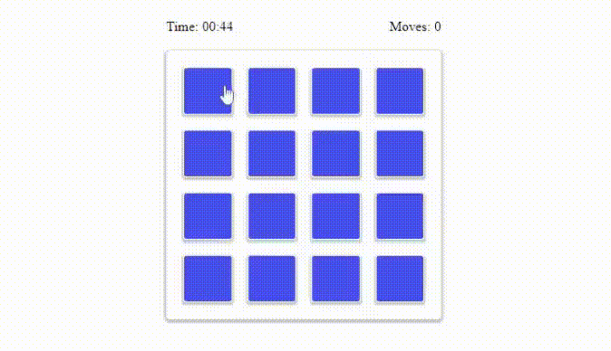

# Memory Game

## Overview

Remoji is a simple and fun card-matching game where the objective is to match pairs of cards by remembering their positions. The game is designed to improve concentration and memory skills.

## Demo:


Play Online: https://remoji123.netlify.app/

## How to Play

1. **Start the Game**: Click on the "Play" button to shuffle the cards and begin.
2. **Flip Cards**: Click on any two cards to flip them over.
3. **Match Cards**: If the two flipped cards match, they remain face-up. If they don't match, they will flip back over after a short delay.
4. **Win the Game**: Continue matching pairs until all cards are matched. The game is won when all pairs are successfully matched.

## Features

- **Responsive Design**: The game adjusts to different screen sizes for an optimal playing experience on both desktop and mobile devices.
- **Timer**: The game includes a timer to track how long it takes to complete the game.
- **Move Counter**: Keep track of the number of moves taken to complete the game.

## Installation

To play the game locally:

1. Clone the repository:
   ```bash
   git clone https://github.com/jimavictor/remoji.git
2. Navigate to the project directory:
   ```bash
   cd remoji
3. Open the index.html file in your browser to start playing.

## Technology Used
- HTML
- CSS 
- JavaScript
